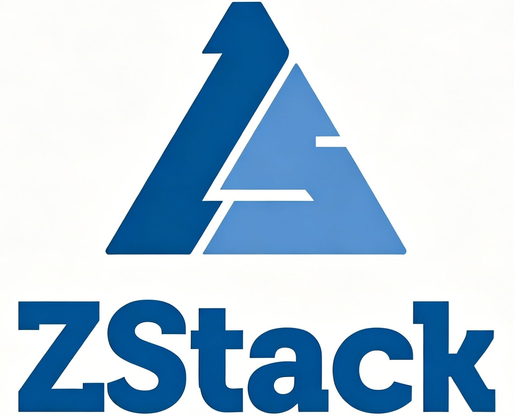

  
  <h1>ZSphere</h1>

  
<strong>Next-generation server virtualization platform for private cloud and enterprise virtualization.</strong>

  

    <a href="#resources">Resources</a> •
    <a href="#architecture">Architecture</a> •
    <a href="#quick-start">Quick Start</a> •
    <a href="#installation">Installation</a> •
    <a href="#roadmap">Roadmap</a> •
    <a href="#contributing">Contributing</a>
  

  

    English | <a href="README_zh.md">简体中文</a>
  

## Introduction
ZSphere is a next-generation server virtualization platform for private cloud, server virtualization, and enterprise cloud management. Built on the principles of high performance, strong security, high reliability, and continuous innovation, it integrates server, network, and storage virtualization with intelligent operations capabilities to help organizations build and operate modern virtualization infrastructure.

This repository is the main entry point for the ZSphere open-source project. It provides project overview, documentation links, repository index, contribution guidelines, roadmap, governance, and community resources.

## Resources

- [Community Website](https://zsphere.aliyun.com/)
- [Product Documentation](https://www.zstack.io/help/zstack_zsphere)

## Architecture

ZSphere uses a modular architecture built around virtualization resource management, the management plane, extension services, and operational tooling.

Core capabilities include:

- **Compute virtualization**: host, cluster, virtual machine, image, and lifecycle management.
- **Network virtualization**: virtual networks, network services, security groups, VPC, load balancing, and related capabilities.
- **Storage virtualization**: primary storage, backup storage, volumes, snapshots, and storage resource management.
- **Management plane**: API framework, permission model, events, alarms, auditing, and system operations.
- **Extension services**: capabilities for migration, disaster recovery, monitoring, quota management, access control, and enterprise operations.
- **Tools and integrations**: installation tools, diagnostics tools, migration tools, automation scripts, agents, CLI, and external system integrations.

At the software architecture level, ZSphere emphasizes asynchrony, statelessness, extensibility, and automation:

- **Asynchronous architecture**: supports asynchronous messages, asynchronous methods, and asynchronous HTTP calls to reduce blocking and improve system throughput.
- **Stateless services**: individual requests do not depend on state from other requests, making services easier to scale, recover, and operate.
- **Plugin-based extensibility**: supports horizontal extension of resource types, business capabilities, and integration capabilities through plugins.
- **Workflow engine**: manages the execution order of complex operations and supports rollback and recovery in failure scenarios.
- **Tagging and query capabilities**: supports resource attribute extension, resource classification, unified queries, and automation orchestration.
- **Automated deployment**: uses automation tools to handle deployment, configuration, and operations tasks, reducing deployment and maintenance complexity.

## Quick Start

The fastest way to evaluate ZSphere is to follow the quick start guide in the product documentation. It walks you through preparing compute, network, and storage resources, initializing the management service, and creating your first virtual machine.

- [Quick Start](https://www.zstack.io/help/zstack_zsphere/user_guide/v5.0.0/1.html)

## Installation

The installation guide will cover environment preparation, deployment steps, node configuration, service startup, and installation verification to help users deploy a working ZSphere environment.

- [Installation Guide](https://zsphere.aliyun.com/docs/installation/)

## VMware Migration Guide

As enterprises reassess their virtualization strategies, migration from VMware to alternative platforms has become an important topic for organizations seeking cost control, infrastructure flexibility, and long-term operational stability. ZSphere provides migration-oriented capabilities and operational tools to help users evaluate, plan, and move workloads from existing VMware environments to ZStack-based virtualization infrastructure.

- [VMware Migration Guide](https://www.zstack.io/thesolution/virtualization/)

## Project Repositories

| Repository | Description |
|---|---|
| [zstack](https://github.com/zsphereio/zstack) | Core IaaS engine and cloud infrastructure foundation of ZSphere |
| [premium](https://github.com/zsphereio/premium) | Extension modules for enterprise operations and advanced scenarios |
| [zstack-utility](https://github.com/zsphereio/zstack-utility) | Tools for installation, diagnostics, migration, and operations |

## Roadmap

The ZSphere roadmap provides information about upcoming project work, planned milestones, feature tracking, and open-source release preparation.

👉 [Read the Release Notes](https://github.com/zsphereio/zsphere/releases) | [View Roadmap](https://github.com/zsphereio/zsphere/projects)

## Governance

ZSphere is governed by a lightweight open-source governance model that defines how the project is maintained, how decisions are made, and how contributors collaborate.

The [GOVERNANCE.md](GOVERNANCE.md) document is the starting point for learning about project roles, maintainer responsibilities, decision-making processes, release management, and community collaboration.

As the community grows, the governance model may evolve to include dedicated maintainers, working groups, and more formal project processes.

## Contributing

We welcome and appreciate contributions from the community. Whether you are fixing bugs, improving documentation, proposing features, adding tests, or sharing deployment, migration, and operational practices, your contribution helps make ZSphere better.

If you are new to the project, you can start with documentation improvements, issue reports, test verification, migration experience, or community discussions. Developers are also welcome to contribute code improvements, tooling enhancements, and integrations.

We may recognize active contributors through community acknowledgements, release notes, contributor lists, or future community programs.

Before contributing, please read:

- [CONTRIBUTING.md](CONTRIBUTING.md)

## Security

The security process for reporting vulnerabilities is described in [SECURITY.md](SECURITY.md).

## License

ZSphere is licensed under the [GNU General Public License v3.0](LICENSE).

Some repositories or components may include third-party open-source software under different licenses. Please check the `LICENSE`, `NOTICE`, and related files in each repository for details.
